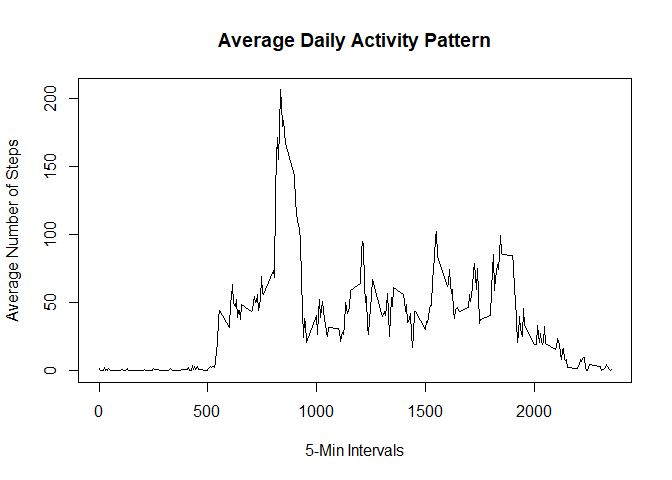
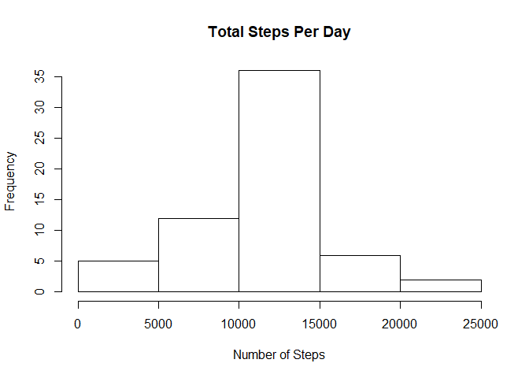
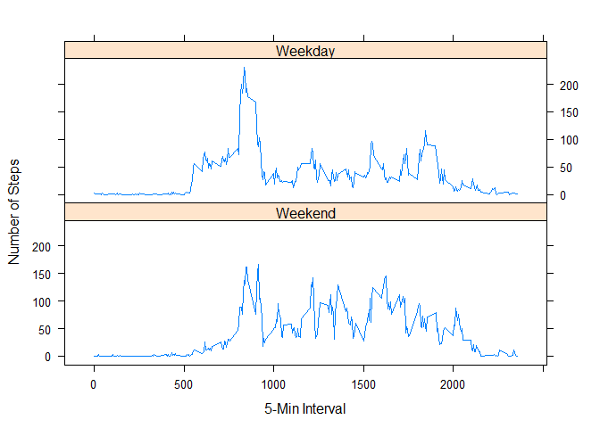

## Loading and preprocessing the data
First, we want to read through the activity data by using the read.csv() function. The data is separated by commas and has a header.

```r
data <- read.csv("activity.csv", sep = ",", header = TRUE, na.strings = "NA")
```
Here is the str() of the data:

```r
str(data)
```

```
## 'data.frame':	17568 obs. of  3 variables:
##  $ steps   : int  NA NA NA NA NA NA NA NA NA NA ...
##  $ date    : Factor w/ 61 levels "2012-10-01","2012-10-02",..: 1 1 1 1 1 1 1 1 1 1 ...
##  $ interval: int  0 5 10 15 20 25 30 35 40 45 ...
```
We can see that the date variable is a Factor class with 61 levels. We want to change this to a date time class by using the as.POSIXct() function:

```r
data$date <- as.POSIXct(as.character(data$date), format = "%Y-%m-%d")
```

## What is mean total number of steps taken per day?
To find the mean total number of steps taken per day, we can use the aggregate() function to subset the steps by the date and apply the sum() function on it. Then, we can create a histogram to show the results. 

```r
total_steps <- aggregate(steps~date, data = data, FUN = sum, na.rm = TRUE)
hist(total_steps$steps, xlab = "Number of Steps", main = "Total Steps Per Day")
```

<!-- -->

To find the mean and median of the total steps taken per day, we can use the functions mean() and median()

```r
mean_steps <- mean(total_steps$steps, na.rm = TRUE)
mean_steps
```

```
## [1] 10766.19
```

```r
median_steps <- median(total_steps$steps, na.rm = TRUE)
median_steps
```

```
## [1] 10765
```

## What is the average daily activity pattern?
To find the average number of steps taken by 5-minute intervals we can once again use the aggregate() function but subset the steps by interval this time around. Then, we can make a time series plot with plot() and setting type = "l".

```r
avg_steps <- aggregate(steps~interval, data = data, FUN = mean, na.rm = TRUE)
plot(x = avg_steps$interval, y = avg_steps$steps, type = "l",
     xlab = "5-Min Intervals", ylab = "Average Number of Steps",
     main = "Average Daily Activity Pattern")
```

<!-- -->

Here is the code to find the interval which contains the maximum number of steps:

```r
max_steps <- avg_steps[which.max(avg_steps$steps), ]
max_steps
```

```
##     interval    steps
## 104      835 206.1698
```

## Imputing missing values
Here, we create a new dataset that just replicates the original dataset. We will replace all the NA values with the mean values we found earlier from avg_steps. We can do this by using a nested for loop that goes through each position of the new dataset and matches it with the position of avg_steps to replace the NA values with the mean values. 

```r
data1 <- data
for (i in 1:17568) { ## For each index through all of data1
    if (is.na(data1$steps[i])) { ## If a position index is NA
        intervalIndex <- data1$interval[i] ## Store the position index
        for (j in 1:288) { ## For each index in avg_steps
            if (avg_steps$interval[j] == intervalIndex) { ## If the position in avg_steps matches the NA position index 
                data1$steps[i] <- avg_steps$steps[j] ## Replace the NA with the mean 
            }  
        }
    }  

}
```

Now, we can create a histogram of this new dataset and compare it with our original plots. To do this we can once again use the aggregate() function and hist().

```r
total_steps1 <- aggregate(steps~date, data = data1, FUN = sum, na.rm = TRUE)
hist(total_steps1$steps, xlab = "Number of Steps", main = "Total Steps Per Day")
```

<!-- -->

We can check the mean and median of this new dataset too.

```r
mean_steps1 <- mean(total_steps1$steps, na.rm = TRUE)
median_steps1 <- median(total_steps1$steps, na.rm = TRUE)
```
Doesn't look like anything has really changed! This is because the NA values were just replaced with the mean values anyway. 

## Are there differences in activity patterns between weekdays and weekends?
Here, we want to create a new factor variable in our new dataset with two levels - "weekday" and "weekend" indicating whether a given date is a weekday or weekend day. First, we can create a vector of the weekdays. Then, create a new variable in the dataset and use the weekdays() function to matchup the dates with our weekdays vector and labels them as either "Weekend" or "Weekday".

```r
weekdays <- c("Monday", "Tuesday", "Wednesday", "Thursday", "Friday")
data1$wday <- factor((weekdays(data1$date) %in% weekdays), levels = c(FALSE, TRUE), labels = c("Weekend", "Weekday"))
```

We can create a time series plot of the 5-min intervals and the average number of steps averaged across all weekend and weekday days. To do this, we can once again use the aggregate() function and subset the steps by BOTH interval and wday. To create a panel plot, I used the xyplot() function in the "lattice" package. 

```r
wday_steps <- aggregate(steps~interval+wday, data = data1, FUN = mean, na.rm = TRUE)
library(lattice)
```

```
## Warning: package 'lattice' was built under R version 3.6.2
```

```r
xyplot(wday_steps$steps ~ wday_steps$interval | wday_steps$wday, layout = c(1,2), type = "l", xlab = "5-Min Interval", ylab = "Number of Steps")
```

<!-- -->
